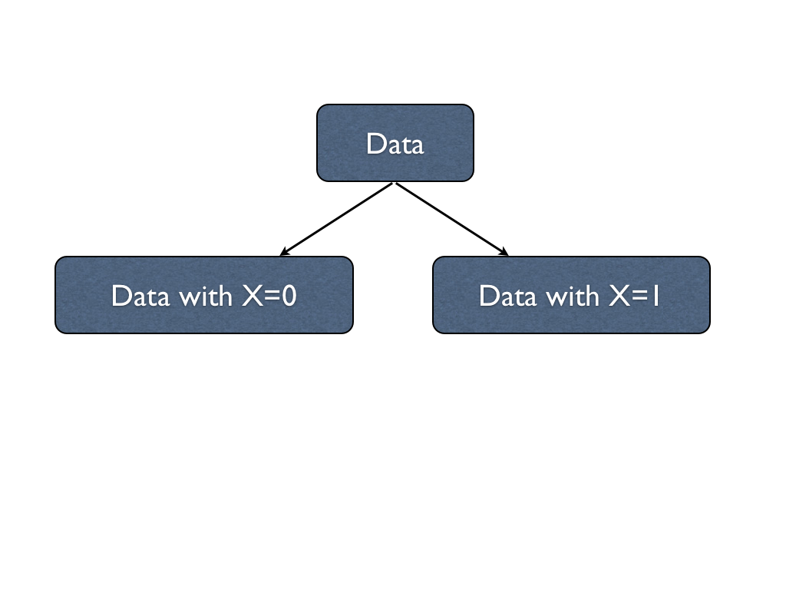
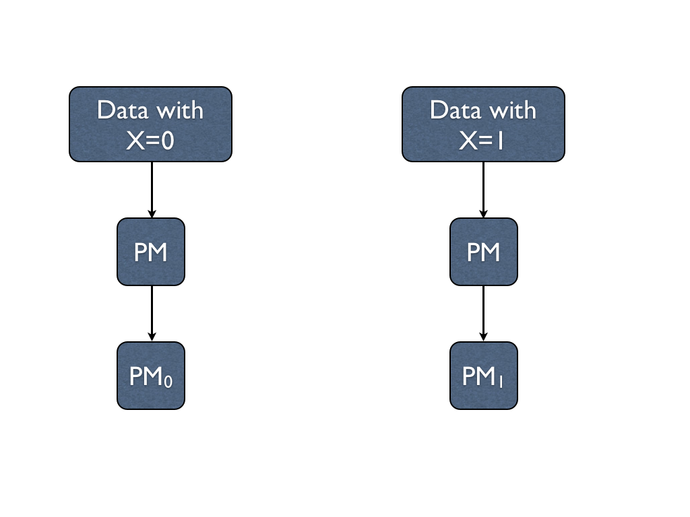
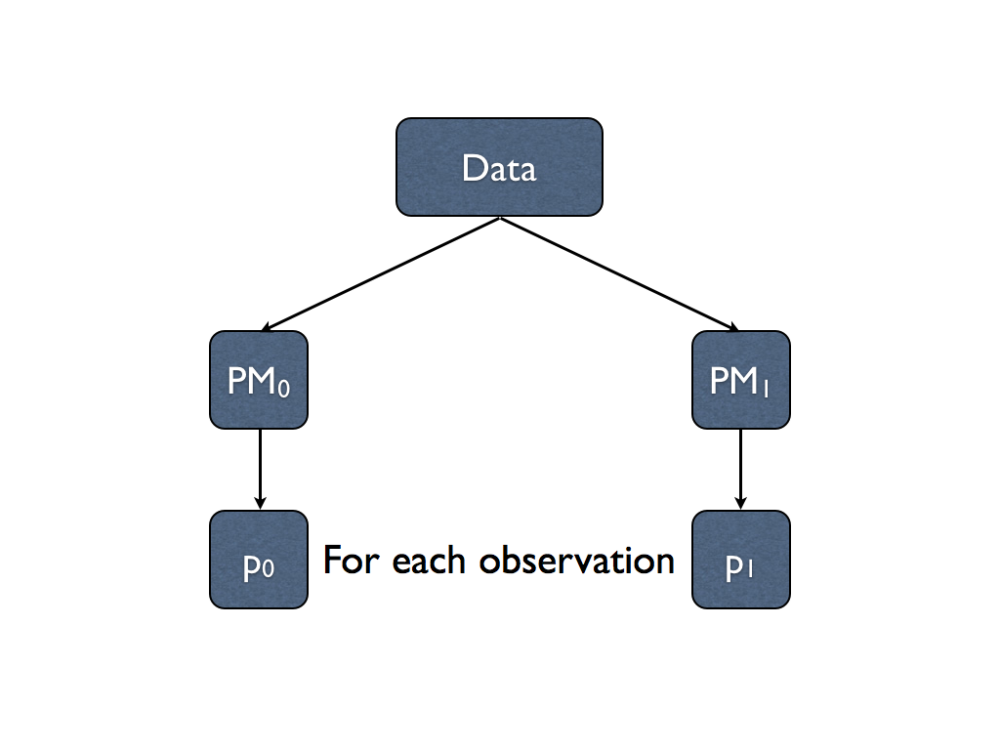
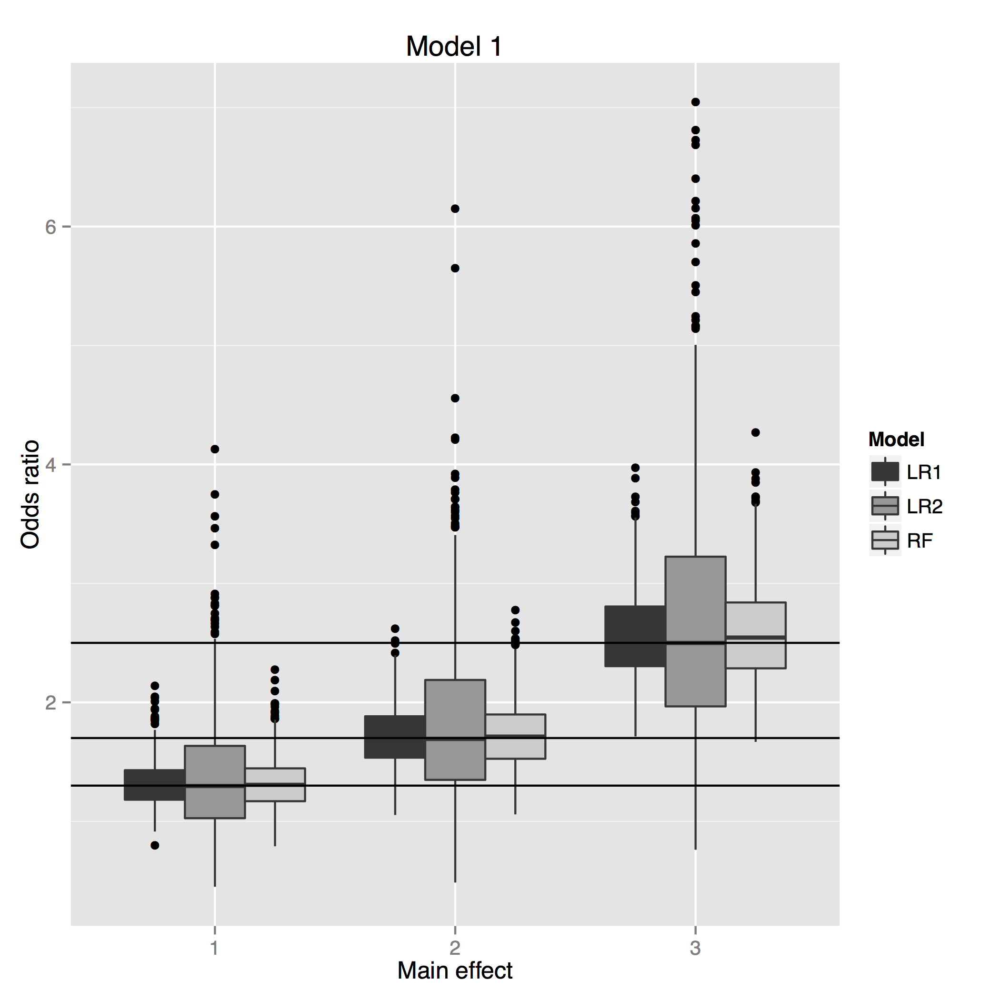
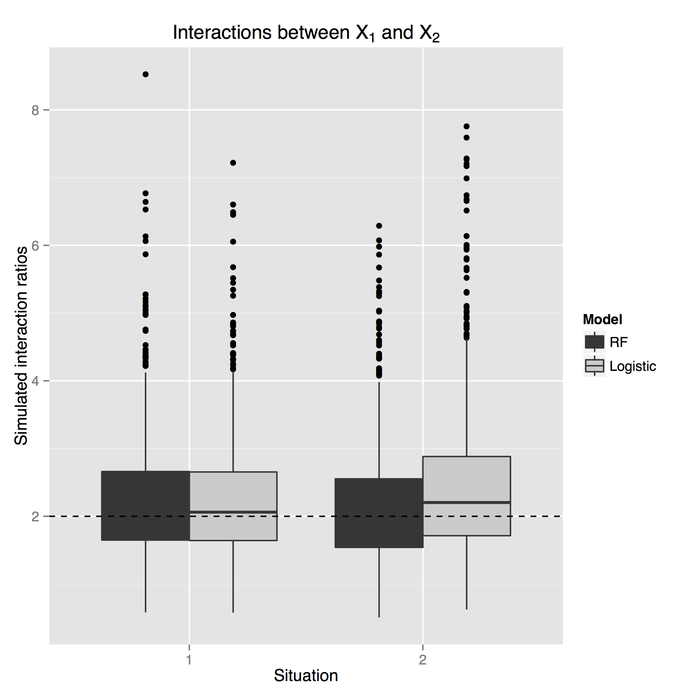
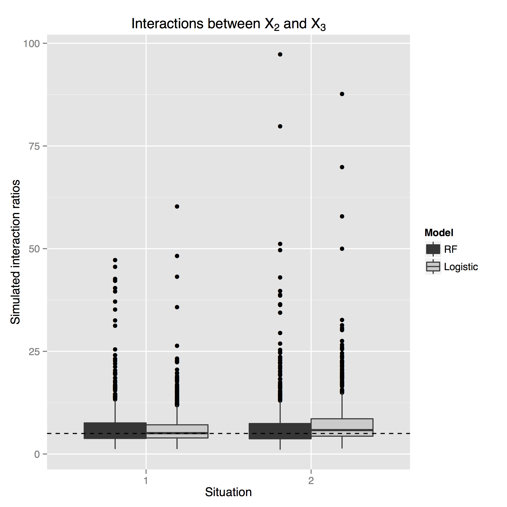
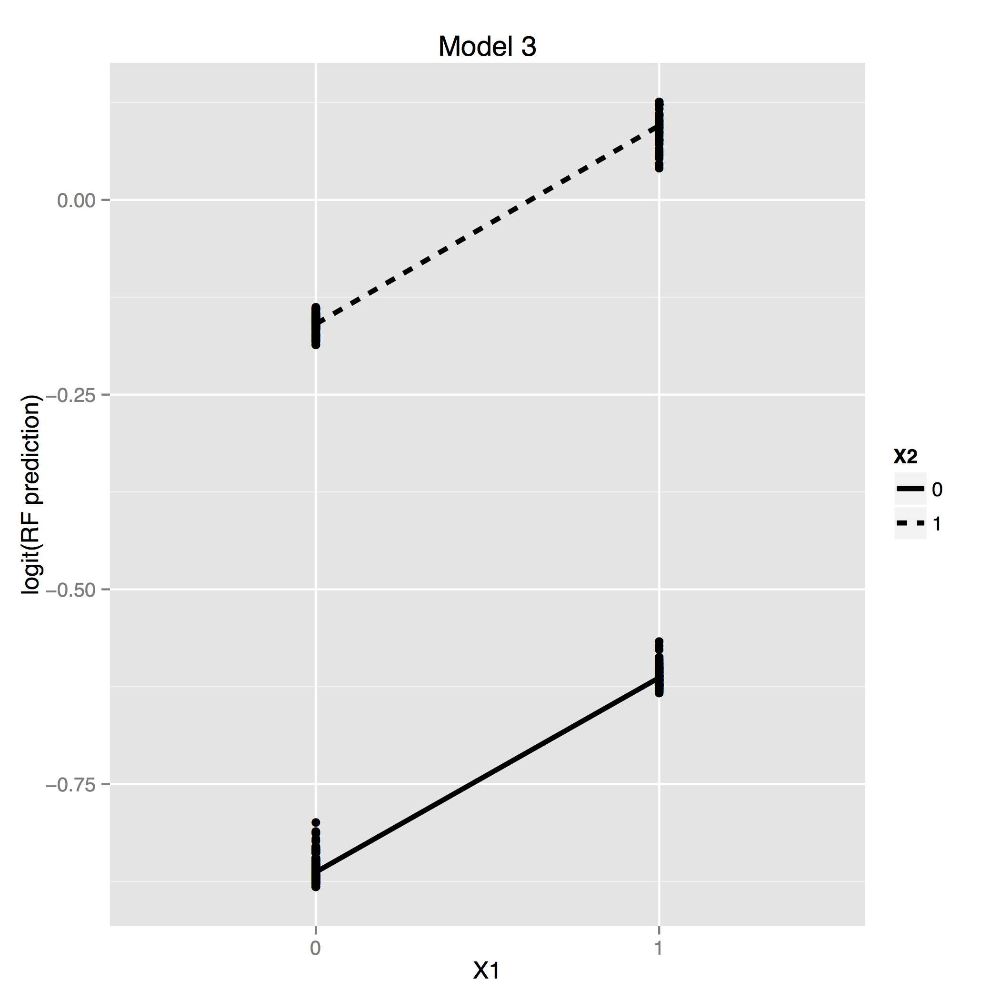
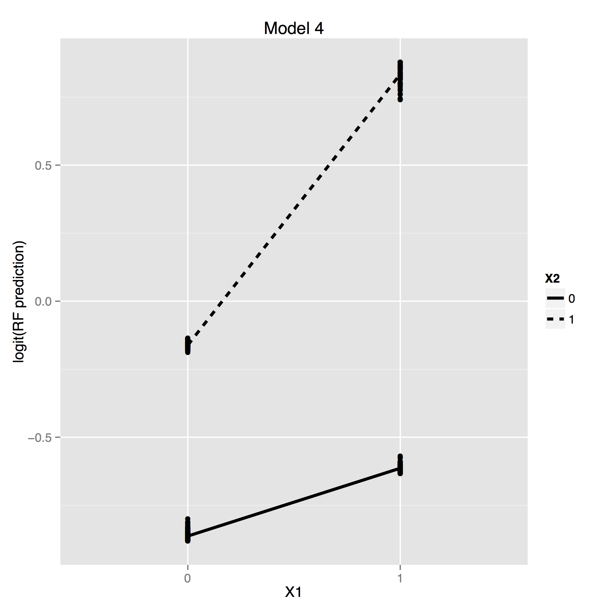

## Effect size

Let's go back to your first regression course

<blockquote style="color:#66a;font-size:30px;font-weight:bold;font-style:italic;margin:1em 3em;">
"How much does the outcome change, on average, when a predictor changes
by one unit, all other predictors remaining the same?"
</blockquote>

---

## Effect size

Let's go back to your first regression course

<blockquote style="color:#66a;font-size:30px;font-weight:bold;font-style:italic;margin:1em 3em;">
"How much does the outcome change, on average, when a predictor changes
by one unit, all other predictors remaining the same?"
</blockquote>

This is based on the concept of <span style="font-style:italic;text-decoration:underline;">counterfactuals</span>

> + What would happen <span style="font-weight:bold">if</span> a predictor changed by 1 unit keeping everything else the same?
> + This is not something we can observe, but only something we can conceptualize
> + Using multiple machines, we can actually estimate these counterfactuals directly <span style="font-weight:bold">for each observation!!!</span>
> + We don't need parameters in the model; we can do this nonparametrically
> + Requires us to think about what exactly are the effects we want to interrogate

---

## Counterfactuals

<table border="0">
<tr>
<td align=center> X = 1 </td><td align="center"> X = 0 </td>
</tr>
<tr>
<td></td>
<td> </td>
</tr>
</table>


The counterfactual argument is, in essence

<p style="text-align:center"> If we put an observation in the other landscape, what would it do? </p>

--- 

## Counterfactual machine



--- 

## Counterfactual machine




--- 

## Counterfactual machine




---

## Counterfactual machine

+ PM$_1$ captures the landscape for X=1
+ PM$_0$ captures the landscape for X=0

Now put each observation in each landscape and record its predicted outcome

Note, for each observation we now have a $p_1$ and a $p_0$

Now we can compute <span style="color:blue;font-style:italic"> conditional odds ratios </span> using
$$ OR = \frac{p_1(1-p_0)}{(1-p_1)p_0}$$
for each observation, and look at group-specific odds ratios by averaging or taking medians

---

## Simulations

We generate data from a *logistic regression* model with 

+ 10 independent binary features
+ 3 features associated with outcome to various degrees
+ 7 features not associated with outcome (to mimic sparseness)

---

## Simulations

We fit three models to the generated data

+ Main effects logistic regression <br>
``` glm(y~x1+x2+x3+..., family=binomial) ```

+ Main effects + two-way interactions logistic regression <br>
``` glm(y~(x1+x2+x3+...)^2, family=binomial) ```

+ Random forest regression <br>
``` randomForest(y~x1+x2+x3+...) ```

For this entire exercise, <span style="font-weight:bold">we do not change this code</span>

---

## Simulations



Look at a main effects model

+ All 3 are unbiased
+ RF does as well as logistic regression for efficiency


--- .segue .dark

## WARNING: Soapbox time

---

## Logistic regression and odds ratios

Logistic regression (the industry standard) gives us odds ratios (the industry standard)

---

## Logistic regression and odds ratios

Logistic regression (the industry standard) gives us odds ratios (the industry standard)

<p style="font-size:50px;text-align:center">Please try explaining what an odds ratio is</p>

---

## Logistic regression and odds ratios

Logistic regression (the industry standard) gives us odds ratios (the industry standard)


+ The odds ratio is interpreted as a risk ratio

  + Can only do this when the outcome is rare
  
+ The odds ratio might be reasonable for gamblers (Hello, Bernoullis), but probably not for clinicians

+ If I had my way, we'd report either risk ratios or risk differences

--- .segue .dark

## Now back to regular programming

---

## Counterfactual machine

We have individual $p_1$ and $p_0$, so we can directly compute 

+ risk differences $$ RD = p_1 - p_0 $$
+ risk ratios $$ RR = p_1/p_0 $$

---

## Multiple machines model

### What about interactions?

Since we have a way of estimating counterfactuals, estimating conditional interaction effects are straightforward

Make 4 machines to "capture landscapes" when

+ X1 = 0, X2 = 0 ($\rightarrow p_{00}$)
+ X1 = 1, X2 = 0 ($\rightarrow p_{10}$)
+ X1 = 0, X2 = 1 ($\rightarrow p_{01}$)
+ X1 = 1, X2 = 1 ($\rightarrow p_{11}$)

Now compute the appropriate contrast ($p_{11} - p_{10} - p_{01} + p_{00}$) or ratio 
$$\frac{p_{11}(1-p_{10})}{p_{10}(1-p_{11})}/\frac{p_{01}(1-p_{00})}{p_{00}(1-p_{01})}$$

---

## Multiple machines models



<p style="clear:both;"></p>


---

## More about interactions

The Counterfactual Machine$^{TM}$ is cumbersome when you have many features.

We can actually do a faster scan of the data to find 2-way interactions

We call it the <span style="color:blue;font-weight:bold">Interactor$^{TM}$</span>

---

## The Interactor

We fit one PM to the data and get predicted probabilities

+ Average probabilities over X1=1, X2=1 $\rightarrow P_{11}$
+ Average probabilities over X1=0, X2=1 $\rightarrow P_{01}$
+ Average probabilities over X1=1, X2=0 $\rightarrow P_{10}$
+ Average probabilities over X1=0, X2=0 $\rightarrow P_{00}$

We can now create classical interaction plots either on natural or logit scale

---

## The Interactor



<p style="clear:both;"></p>

---

## The Interactor

### How about when we need to scan an entire genome?

1. Run 1 PM on the dataset
2. Compute interaction contrasts for each pair of features 
3. Create an interaction heatmap to find interaction hotspots
4. Drill down (MDS, more analyses)

--- bg:url(figure/Ratu-Boko-Yogya.jpg)

--- bg:url(figure/img_6940.jpg)

## On to the post-parameter ecosystem